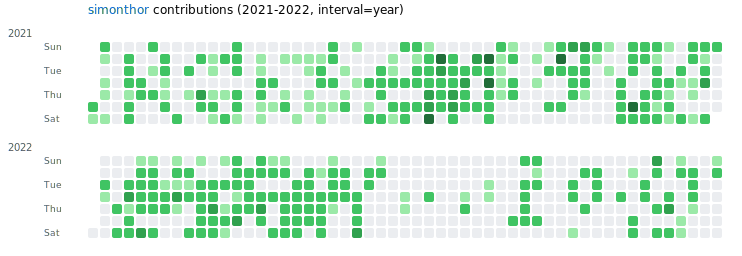

# Github Contributions Visualizer


Visualize **all** the Github contributions of any Github user with a simple command line tool. The tool generates a SVG file that can be easily shared or embedded in websites.

On the Github website, only the contributions from one year are visible. This tool allows you to see the contributions from all years in a single SVG file.
The colors are normalized to the maximum contributions in a single day over the whole period that a user has been active, so the colors are comparable across years.

The number of contributions per day is shown as a tooltip when hovering over the corresponding square in the SVG file. The output can be split into rows by full period, by year, or by month, depending on your preference. Start and end years can also be specified to focus on a specific time range.

## Installation
You can install the tool using pip:
```bash
pip install git+https://github.com/simonthor/github-visualizer.git
```
or run it directly with `uvx`, `pipx` or similar tools:
```bash
uvx git+https://github.com/simonthor/github-visualizer.git
```

## Usage
To generate an SVG file for a specific Github user, run the following command:
```bash
github-visualizer <github_username> --output <output_file.svg>
```
Additional options include:
- `--start-year <year>`: Specify the starting year for the contributions (default is the earliest year of contributions).
- `--end-year <year>`: Specify the ending year for the contributions (default is the latest year of contributions).
- `--interval <none|year|month>`: Split the output into rows by full period, by year, or by month. For `year` and `month`, each row starts on the first day of that year/month.
- `--from-first`: If the user's first-ever contribution day (i.e. the day the Github account was created) is within the loaded years, omit squares for earlier days in the output.

## Example
To visualize the contributions of the user `simonthor` and save it as `simonthor-contributions.svg`, you would run:
```bash
github-visualizer simonthor --output simonthor-contributions.svg
```

## Contributing
Contributions to this project are welcome! If you have any ideas for improvements or new features, please feel free to open an issue or submit a pull request.

While the program itself does not have any dependencies, some libraries are needed when developing the software:
- [ruff](https://github.com/astral-sh/ruff): code formatting and linting
- [ty](https://github.com/astral-sh/ty): type checking
- [pytest](https://github.com/pytest-dev/pytest): testing

These can all be installed by running
```bash
uv install --dev
```
To run the tests, you can use the following command:
```bash
uv run pytest tests
```
Finally, before pushing any code, make sure to run the linter and type checker:
```bash
uv run ruff format
uv run ty check
```
